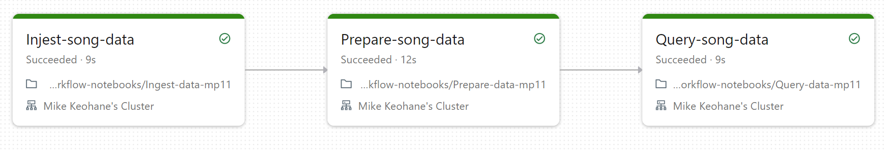

# Mini Project 11 - Data Pipeline with Databricks

Used databricks to pipeline song data. It uses a source - sink architechure, with Injest-song-data loading data as the source, prepare-song-data to prepare it, then query-song-data to query the data as the sink for the end of the pipeline. Databricks allows us to use cells either in python or sql based on notebook settings.

## Data Pipeline


The pipeline can be ran as a databricks workflow. When the workflow is run, the first notebook runs to source the song data from the databricks default datasets. The notebook uses Spark to load this data in to a tabular format.

Next the data is processed through SQL in prepare-data-mp11 by loading in columns from the raw_song_data: [artist_id, artist_name,duration, release, tempo, time_signature, title, year current_timestamp] and saving those values to a new prepared_song_data table.

Finally the data is queried to determine "Which artists released the most songs each year?"  through sql. 
```sql 
SELECT artist_name, count(artist_name)
AS num_songs, year
FROM prepared_song_data
WHERE year > 0
GROUP BY artist_name, year
ORDER BY num_songs DESC, year DESC
```